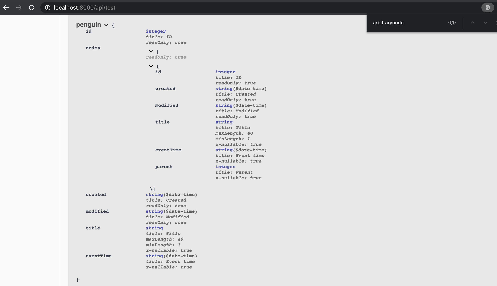

Take a quick look on how to document APIs for your django project that uses the Django Rest Framework.

drf-yasg provides a shortcut for writing documentations, but I wanted to add some points that were not explilcitly described in the documentation.

### Setting up example models, serializers, views

First we add two models `Arbitrary` and `ArbitraryNode`
```
from model_utils.models import TimeStampedModel

from django.db import models


class Arbitrary(TimeStampedModel):
    title = models.CharField(max_length=40, null=True)
    event_time = models.DateTimeField(blank=True, null=True)


class ArbitraryNode(TimeStampedModel):
    title = models.CharField(max_length=40, null=True)
    event_time = models.DateTimeField(blank=True, null=True)
    parent = models.ForeignKey(Arbitrary, models.SET_NULL, blank=True, null=True, related_name="arbitrary_nodes")

```

And then we add serializers
```
from apps.arbitrary.models import Arbitrary
from apps.arbitrary.models import ArbitraryNode
from rest_framework.serializers import ModelSerializer


class ArbitraryNodeSerializer(ModelSerializer):
    class Meta:
        model = ArbitraryNode
        fields = "__all__"


class ArbitrarySerializer(ModelSerializer):
    nodes = ArbitraryNodeSerializer(source="arbitrary_nodes", required=False, read_only=True, many=True)

    class Meta:
        model = Arbitrary
        fields = "__all__"
```

And lastly, the ViewSet (views).
```
from rest_framework import status
from rest_framework.decorators import action
from rest_framework.viewsets import ModelViewSet

from apps.arbitrary.models import Arbitrary
from apps.arbitrary.operations import create_nodes
from apps.arbitrary.serializers import ArbitrarySerializer


class ArbitraryViewSet(ModelViewSet):
    queryset = Arbitrary.objects.all()
    serializer_class = ArbitrarySerializer

    @action(["post"], detail=False, url_path="create-nodes")
    def create_nodes(self, request):
        data = request.data
        arbitrary_id = data.get("id")
```


Setting up swagger with drf-yasg is already well documented in drf-yasg's own documentation. I will be skipping this part because I really recommened visiting the official docs.

## DRF Serializers
DRF Serializers are used to inform the readers how the responses are structured. Request/Response structures are based on the serializer_class defined in the ViewSet. By modifying the serializers, we can provide a richer documentation.

### Documenting models with the Meta class
We can override drf-yasg's default behavior by overriding the Meta class. 

In the meta class, changing the ref_name will change the Model names at the bottom of swagger. If ref_name is set to None, you will not be able to find the model schema at the bottom.

Let's try changing the model names to `None` and `"penguin"`.
```
from apps.arbitrary.models import Arbitrary
from apps.arbitrary.models import ArbitraryNode
from rest_framework.serializers import ModelSerializer


class ArbitraryNodeSerializer(ModelSerializer):
    class Meta:
        model = ArbitraryNode
        ref_name = None
        fields = "__all__"


class ArbitrarySerializer(ModelSerializer):
    nodes = ArbitraryNodeSerializer(source="arbitrary_nodes", required=False, read_only=True, many=True)

    class Meta:
        model = Arbitrary
        ref_name = "penguin"
        fields = "__all__"

```
We refresh the swagger document


Now we cannot find the Model for ArbitraryNode and we see a model called penguin instead of Arbitrary.

You can also define `swagger_schema_fields` to give the model a new name and a description.
```
class ArbitrarySerializer(ModelSerializer):
    nodes = ArbitraryNodeSerializer(source="arbitrary_nodes", required=False, read_only=True, many=True)

    class Meta:
        model = Arbitrary
        fields = "__all__"
        swagger_schema_fields = {
            "title": "penguin",
            "description": "Arbitrary model disguised as a penguin"
        }
```
This will now add a description.


## DRF Views/Viewsets
For your API endpoint, use the docstring to provide documentation to the users.

### Formatting your docstring
I wasn't able to find out this detail in the official docs, but I figured out that a markdown-like documentation was possible inside the endpoint's docstring.

If you have a multi-line docstring, you can provide a one-line summary about the API. Note that this summary line should be followed by an empty line.

```

    @action(["post"], detail=False, url_path="create-nodes")
    def create_nodes(self, request):
        """Create or update arbitrary nodes for an arbitrary object

        # This is a header
        ### This is a smaller header
        This is a line of normal text
        ~~Strikethrough~~
        - bullet list item
        - another bullet list item
        <!---
        This is a comment that does not show in swagger
        Only viewable as server-side comment
        -->
        """
```
This will result in a more visually rich documentation.


Note that we can see a 1-line summary unlike other endpoints


### Closing Remarks

Providing a descriptive and well organized API documentation is often overlooked.  

However, documentation plays a crucial part in the developer's experience.  
Developer experience is not limited to the developer's experience with a Framework, but a lot more. 
Like the company's work culture that one belongs to and the resource within that environment that is available to the developer.

Having a nice set of documentations for your APIs can reduce communication cost and provide a better working environment for other engineers.